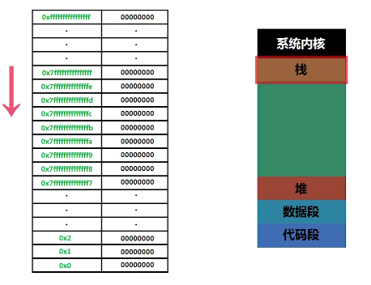
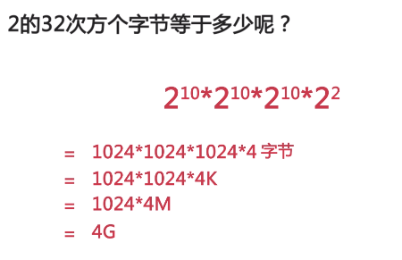
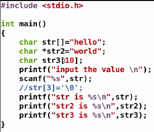
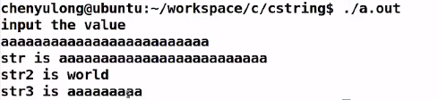

## Linux C指针

[gdb基本使用](https://www.cnblogs.com/HKUI/p/8955443.html)
查看内存：x（输出内存的值）/3（显示值的数量）d（以十进制显示） 0x7fffffffde14（从哪个地址开始显示

`*`  指针符 表示地址指向的空间
`&` 取地址符
 
 1bit = 8二进制位
<!--more-->

int类型 32位 占4个字节
指针保存的就是内存的地址
内存地址：
64位OS下 一个内存地址 = 8bit
32位OS下 一个内存地址 = 4bit
数据段：全局变量（所有函数共用）、常量、静态变量（某个函数特有的）

代码编译后存在代码段外还会存在栈中
没调用一个函数就会调用栈内存
编译时会优化 先把同类型的变量申明同时一起执行

OS会把内存看成一个整体来计算内存的大小
32bit 地址总线（寻址空间是）是32位 最大使用4G内存
32位指的是：给内存的编号只能编到32个二进制位
地址总线可以存在多种状态，32根地址总线就有2^32个状态


栈是由上往下生成 
代码段 数据段 （是不允许随便修改的 一开始就加入了内存中）是由下往上生成

`int quadraate(int a);是一个函数`
`int （*pquadrate)(int a)=&quadrate;将指针pquadtate指向函数quadrate！`
`int s=(*pquadrate)(a)可以调用quadtate函数，这种操作常用于回调函数`
若“p”是一个地址，则“\*p”是到这个地址去取里面的值，“（\*p）”把表示为一个整体，“（\*p）（数据）”若p为代码段，则调用这个函数，传参数"数据"进去。
若地址指向的是栈和堆，操作系统会把栈或者堆的具体数据取出来，若地址指向的不是一个栈或者堆，而是代码段的话，操作系统会认为是指向某一个函数

**指针运算**

指针和数组本质上都是地址 数组能做的指针都能做
但是array永远指的都是同一个地址 不能在地址上做偏移 是一种指针常量

```cpp
int *p=&a;
p+=3;//表示地址指针的偏移运算，把内存地址往下移动三格 12个字节
*p=101;//这两句等同于p[3]=101 但是p[]这种p的指针没有变
p++;//表示地址指针往下移动一格 因为p是int类型 所有每格为4个字节
p = &a;
//*p表示所指向的内存空间的值;
//p是所指向内存空间的内存首地址;
//&p 是指p指针变量在内存中的地址;
```

**字符数组**
```
char str[] = "abc";//栈内存中
char *str2 = "abc";//str2指向的是代码段，abc是常量字符串，不可以被修改
char str3 = [10];//栈内存中
```
字符串以\0结束 
指针变量char *str2 = "hello"，用scanf 向str2中输入字符串出错，其实也可以这么理解，指针str2只是指向一个地址，从这个地址开始写入"hello",没有指定内存长度，没有空间去容纳字符串。内存溢出！这个与char str[] = "hello"不同，str已经有了6个字节的内存空间，

C语言在内存中数据的存储位置
char a[] = “linux” 
占6个字节，a存储的是首地址，“linux”可以在栈，也可以在堆中 
char *p = “linux” 
占10个字节，p指针变量占4字节，里面保存的是后面字符串的地址，“linux”占6个字节，存储在代码段。



超出存储范围后 程序会按照地址顺序继续存储后面的字符 