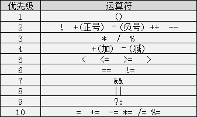
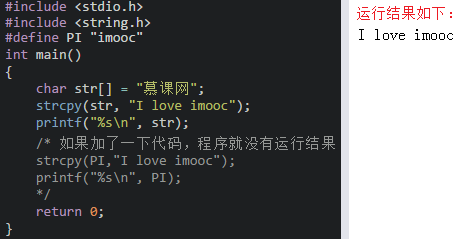
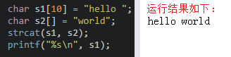

## C笔记

语言中，数据类型可分为：基本数据类型，构造数据类型，指针类型，空类型四大类。

<!--more-->
整型、实型与字符型。


注：int、short int、long int是根据编译环境的不同，所取范围不同。而其中short int和long int至少是表中所写范围，但是int在表中是以16位编译环境写的取值范围。另外 c语言int的取值范围在于他占用的字节数 ，不同的编译器，规定是不一样。ANSI标准定义int是占2个字节，TC是按ANSI标准的，它的int是占2个字节的。但是在VC里，一个int是占4个字节的。


###格式化输出语句

格式化输出语句，也可以说是占位输出，是将各种类型的数据按照格式化后的类型及指定的位置从计算机上显示。

其格式为：printf("输出格式符"，输出项);

C语言中的常用格式化符：


注意：格式符的个数要与变量、常量或者表达式的个数一一对应 

### 常量

C语言的常量可以分为直接常量和符号常量。
直接常量也称为字面量，是可以直接拿来使用，无需说明的量。
在C语言中，可以用一个标识符来表示一个常量，称之为符号常量。符号常量在使用之前必须先定义，其一般形式为：

` #define 标识符 常量值 `

符号常量的标示符一般习惯使用大写字母，变量的标示符一般习惯使用小写字母，加以区分。
**注意：#define 放置于main() 前，结尾无分号，量是不可改变的**

###自动类型转换

自动转换发生在不同数据类型运算时，**在编译的时候自动完成**。


**char类型数据转换为int类型数据遵循ASCII码中的对应值，ASCII码请查看WIKI。**

注：字节小的可以向字节大的自动转换，但字节大的不能向字节小的自动转换

###强制类型转换

强制类型转换是通过定义类型转换运算来实现的。其一般形式为：
` (数据类型) (表达式) `

在使用强制转换时应注意以下问题：

1、数据类型和表达式都必须加括号，如把(int)(x/2+y)写成(int)x/2+y则成了把x转换成int型之后再除2再与y相加了。

**2、转换后不会改变原数据的类型及变量值，只在本次运算中临时性转换。**

**3、强制转换后的运算结果不遵循四舍五入原则（是向下取整 -2.5 —> -3）。**

###运算符

取余运算中注意：
该运算只适合用两个整数进行取余运算，如：10%3 = 1；而10.0%3则是错误的；运算后的符号取决于被模数的符号，如(-10)%3 = -1;而10%(-3) = 1。

###优先级



### for循环顺序


它的执行过程如下：

第一步：执行表达式1，对循环变量做初始化；

第二步：判断表达式2，若其值为真（非0），则执行for循环体中执行代码块，然后向下执行；若其值为假（0），则结束循环；

第三步：执行表达式3；

第四步：执行for循环中执行代码块后执行第二步；

第五步：循环结束，程序继续向下执行。

###自创函数


自定义函数的一般形式：


注意：

1、[ ]包含的内容可以省略，数据类型说明省略，默认是int类型函数；参数省略表示该函数是无参函数，参数不省略表示该函数是有参函数；

2、函数名称遵循标识符命名规范；

3、自定义函数尽量放在main函数之前，如果要放在main函数后面的话，需要在main函数之前先声明自定义函数，声明格式为：[数据类型说明] 函数名称（[参数]）;

**C语言没有重载。**
但是C语言作为一个具有超强功能的底层语言，是有办法进行模拟函数重载的。那就是函数指针。最简单的例子就是qsort函数。这个函数可以传递一个函数指针变量，通过不同的函数指针，可以对不同的数据类型就行相同的qsort操作，从某种层面来说相当于函数重载。

**C语言中局部变量可以与全局变量同名**
在函数内引用这个变量时，会用到同名的局部变量，而不会用到全局变量。对于有些编译器而言，在同一个函数内可以定义多个同名的局部变量，比如在两个循环体内都定义一个同名的局部变量，而那个局部变量的作用域就在那个循环体内

###变量存储类别
C语言根据变量的生存周期来划分，可以分为静态存储方式和动态存储方式。

静态存储方式：是指在程序运行期间分配固定的存储空间的方式。静态存储区中存放了在整个程序执行过程中都存在的变量，如全局变量。

动态存储方式：是指在程序运行期间根据需要进行动态的分配存储空间的方式。动态存储区中存放的变量是根据程序运行的需要而建立和释放的，通常包括：函数形式参数；自动变量；函数调用时的现场保护和返回地址等。

C语言中存储类别又分为四类：自动（auto）、静态（static）、寄存器的（register）和外部的（extern）。

1、用关键字auto定义的变量为自动变量，auto可以省略，auto不写则隐含定为“自动存储类别”，属于动态存储方式。

2、用static修饰的为静态变量，如果定义在函数内部的，称之为静态局部变量；如果定义在函数外部，称之为静态外部变量。
注意：静态局部变量属于静态存储类别，在静态存储区内分配存储单元，在程序整个运行期间都不释放；静态局部变量在编译时赋初值，即只赋初值一次；如果在定义局部变量时不赋初值的话，则对静态局部变量来说，编译时自动赋初值0（对数值型变量）或空字符（对字符变量）。

3、为了提高效率，C语言允许将局部变量得值放在CPU中的寄存器中，这种变量叫“寄存器变量”，用关键字register作声明。
注意：只有局部自动变量和形式参数可以作为寄存器变量；一个计算机系统中的寄存器数目有限，不能定义任意多个寄存器变量；局部静态变量不能定义为寄存器变量。

4、用extern声明的的变量是外部变量，外部变量的意义是某函数可以调用在该函数之后定义的变量。

###内部函数与外部函数
在C语言中不能被其他源文件调用的函数称谓内部函数 ，**内部函数由static关键字来定义**，因此又被称谓静态函数，形式为：

` static [数据类型] 函数名（[参数]） `

这里的static是对函数的作用范围的一个限定，限定该函数只能在其所处的源文件中使用，因此在不同文件中出现相同的函数名称的内部函数是没有问题的。

在C语言中能被其他源文件调用的函数称谓外部函数 ，外部函数由extern关键字来定义，形式为：

` extern [数据类型] 函数名([参数]) `

C语言规定，在没有指定函数的作用范围时，**系统会默认认为是外部函数**，因此当需要定义外部函数时extern也可以省略。

### 数组

它在程序中是一块连续的，大小固定并且里面的数据类型一致的内存空间，它还有个好听的名字叫数组。

C语言中的数组初始化是有三种形式的，分别是：
**注意括号只能放在数组名称后，传参不用加括号，形参需要加括号**
1、 数据类型 数组名称[长度n] = {元素1,元素2…元素n};

2、 数据类型 数组名称[] = {元素1,元素2…元素n};

3、 数据类型 数组名称[长度n]; 数组名称[0] = 元素1; 数组名称[1] = 元素2; 数组名称[n-1] = 元素n;

**如果采用第一种初始化方式，元素个数小于数组的长度时，多余的数组元素初始化为0；**
在声明数组后没有进行初始化的时候，**静态（static）和外部（extern）类型的数组元素初始化元素为0**，自动（auto）类型的数组的元素初始化值不确定。

> 定义一个数组，开辟一段内存空间，这段内存空间并不会像被围墙围住一样被封死，合理地利用这个数组，需要程序员自己控制。只定义了这段空间，只有这段空间内的数据对于你当前的程序是合理的，越界的话就不知道你访问到哪里去了，它可能属于机器上任何一个运行着的进程，因为机器上的进程使用的都是这一条内存。如果你修改了你越界访问到的数据，可能会造成未知的错误。
> int a[3] = {1,2,3};这样的定义，a表示的是开辟的这一段空间的首地址，[]里的数字表示相对这个地址的偏移量，访问数组是这样进行的
> 你可以通过sizeof()获得某个类型的大小，但是程序运行时不会去检查下标是否越界。这样的检查是需要耗费资源的，理想的情况下，这样做对于程序运行也没有意义。C/C++没有这样做这样的检查，C#、java 都是有这样的检查的

```
int a[10] = {0};
int cnt = sizeof(a) / sizeof(a[0]);
输出结果是：
cnt = 10
```
这样不管数组是增加还是减少元素，sizeof(a)/sizeof(a[0]) 都能自动求出数组的长度。需要注意的是，它求出的是数组的总长度，而不是数组中存放的有意义的数据的个数。
`int a[10] = {1, 2, 3, 4, 5};`
我们只初始化了五个元素，但是 sizeof(a)/sizeof(a[0]) 求出的是 10，而不是 5。换句话说，我们无法通过 sizeof(a)/sizeof(a[0]) 求出数组中有多少个有意义的数据。

### 字符串与数组

在C语言中，是没有办法直接定义字符串数据类型的，但是我们可以使用数组来定义我们所要的字符串。一般有以下两种格式：

1、char 字符串名称[长度] = "字符串值";

2、char 字符串名称[长度] = {'字符1','字符2',...,'字符n','\0'};

注意：

1、[]中的长度是可以省略不写的；

2、采用第2种方式的时候最后一个元素必须是'\0'，'\0'表示字符串的结束标志；

3、采用第2种方式的时候在数组中不能写中文。

在输出字符串的时候要使用：`printf(“%s”,字符数组名字);或者puts(字符数组名字);`

### 字符串函数

`#include <string.h>`


使用字符串函数注意以下事项:

1、`strlen()`获取字符串的长度，在字符串长度中是不包括'\0'而且汉字和字母的长度是不一样的。


2、`strcmp()`在比较的时候会把字符串先转换成ASCII码再进行比较,返回的结果为0表示s1和s2的ASCII码相等,返回结果为1表示s1比s2的ASCII码大,返回结果为-1表示s1比s2的ASCII码小。


3、`strcpy()`拷贝之后会覆盖原来字符串且不能对字符串常量进行拷贝。


4、`strcat()`在使用时s1与s2指的内存空间不能重叠，且s1要有足够的空间来容纳要复制的字符串，


### 多维数组

`数据类型 数组名称[常量表达式1][常量表达式2]...[常量表达式n];`

我们可以把上面的数组看作一个3×3的矩阵，如下图:


多维数组的初始化与一维数组的初始化类似也是分两种:

1、```数据类型 数组名称[常量表达式1][常量表达式2]...[常量表达式n] = {{值1,..,值n},{值1,..,值n},...,{值1,..,值n}};```
2、```数据类型 数组名称[常量表达式1][常量表达式2]...[常量表达式n]; 数组名称[下标1][下标2]...[下标n] = 值;```

多维数组初始化要注意以下事项:

1、采用第一种始化时数组声明**必须指定列的维数**。因为系统会根据数组中元素的总个数来分配空间，当知道元素总个数以及列的维数后，会直接计算出行的维数,

2、采用第二种初始化时数组声明必须**同时指定行和列**的维数。

**二维数组定义的时候，可以不指定行的数量，但是必须指定列的数量。**

