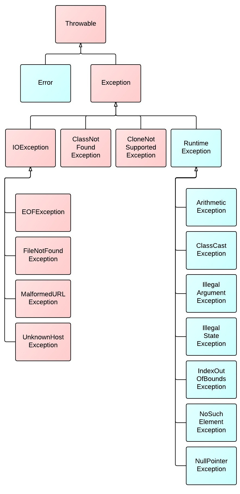
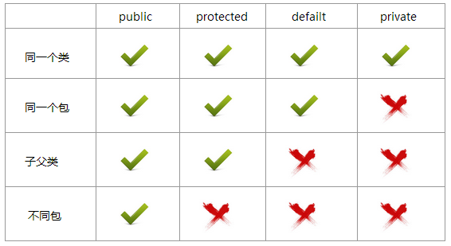
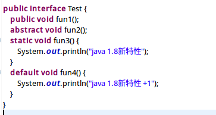
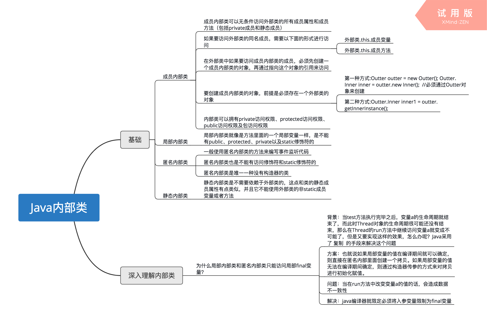
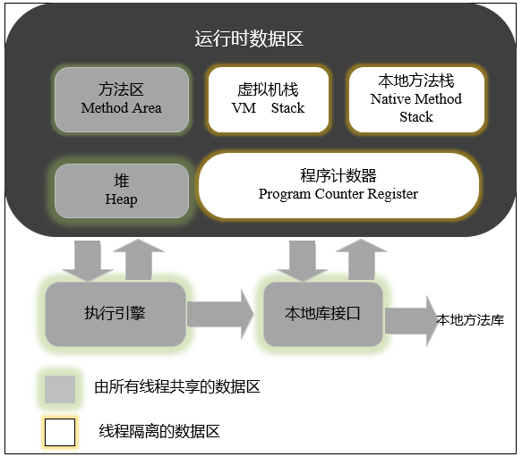
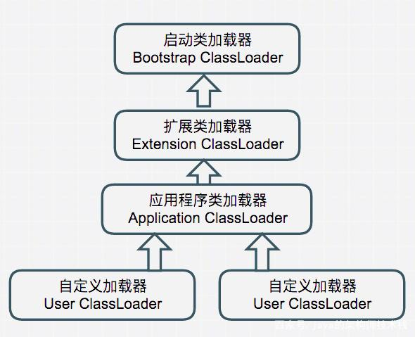

## Java回顾总结

最近重温Java，做出总结，本文共分为语法细节、语法特点、接口&抽象类、版本变化、内部类、集合框架、JVM、类加载器八个部分。
<!--more-->

---
### 语法细节

#### 数据类型
```
java数据类型图：
                      ┏数值型━┳━整数型：byte short int long
       ┏基本数据类型━━┫       ┗━浮点型：float do
       ┃             ┣字符型：char                                          
数据类型╋             ┗布尔型：boolean             
       ┃              ┏类（class）
        ┗引用数据类型━━╋接口（interface）
                       ┗数组（array）
String也是属于引用数据类型
System.out.println("123" instanceof Object);//true
System.out.println(new int[2] instanceof Object); //true
```

#### Integer&int
Integer.valueOf方法中也有判断，如果传递的整型变量>= -128并且小于127时会返回IntegerCache类中一个静态数组中的某一个对象， 否则会返回一个新的Integer对象
int和integer(无论new否)比，都为true，因为会把Integer自动拆箱为int再去比
```java
public static Integer valueOf(int i) {
        assert IntegerCache.high >= 127;
        if (i >= IntegerCache.low && i <= IntegerCache.high)
            return IntegerCache.***[i + (-IntegerCache.low)];
        return new Integer(i);
    }

Integer.valueOf("100")==Integer.valueOf("100")　//true
Integer.valueOf("200")==Integer.valueOf("200")　//false
Integer.valueOf("200")==200 //true
```


#### Byte
 Byte类型值大小为-128~127之间。 a=127;add(++a);这里++a会越界，a的值变为-128 ，再++a 变为 -127。

#### switch
switch支持 byte、short、char、int或者其对应的封装类、Enum类型、String。


#### final
1. 修饰变量，变量的引用地址不可变，但是地址中的内容可以变。
2. 修饰方法，方法不可被重写，但是还是可以重载
3. 修饰类，类不可继承。

#### String
`String c = "my" + "String";`
会在编译时对"my" + "String"进行拼接成myString字符串，再去常量池查找，找到之后指向该字符串地址，所以 `c == "myString"; //true`

- String获取长度用的是length（）方法，而数组类型我们直接用属性length获取长度

**StringBuilder , StringBuffer ,String 都是 final 的**

#### 数组
使用Arrays.equals()  是比较两个数组中的内容。

#### Byte
Byte是byte的包装类型，初始化为null而不是0

#### float
float：小数如果不加 f 后缀，默认是double类型。double转成float向下转换，意味着精度丢失，所以要进行强制类型转换。
`Object o = ‘f’;`：'f' 字符会自动装箱成包装类，就可以向上转型成Object了。
`Double d = 100;`：整数默认是int类型，int类型不能转型为Double，最多通过自动装箱变为Integer但是Integer与Double没有继承关系，也没法进行转型。

#### Thread.yield()
Thread.yield()方法作用是：暂停当前正在执行的线程对象，并执行其他线程。
yield()从未导致线程转到等待/睡眠/阻塞状态。在大多数情况下，yield()将导致线程从运行状态转到可运行状态，但有可能没有效果。

#### GBK->UTF-8
GBK编码字节流到UTF-8编码字节流的转换：
`byte[] src,dst; dst=new String(src，"GBK").getBytes("UTF-8")`

#### 异常
异常的继承结构：基类为Throwable，Error和Exception继承Throwable，Exception又分为运行时异常和编译时异常,RuntimeException和 IOException等继承Exception，具体的RuntimeException继承RuntimeException。
编译时异常是未雨绸缪性质的异常，是防范，需要显示处理。运行时异常是程序员问题造成，并不强制进行显示处理。
运行时异常的特点是Java编译器不会检查它。


---
### 语法特点

#### 访问权限作用域
java的访问权限有public、protected、private和default的，default不能修饰变量


#### 数值操作
两个数值进行二元操作时，会有如下的转换操作：
如果两个操作数其中有一个是double类型，另一个操作就会转换为double类型。
否则，如果其中一个操作数是float类型，另一个将会转换为float类型。
否则，如果其中一个操作数是long类型，另一个会转换为long类型。
否则，两个操作数都转换为int类型。
`double>float>long>int`

Java表达式转型规则由低到高转换：
1、所有的byte,short,char型的值将被提升为int型；
2、如果有一个操作数是long型，计算结果是long型；
3、如果有一个操作数是float型，计算结果是float型；
4、如果有一个操作数是double型，计算结果是double型；
5、被fianl修饰的变量不会自动改变类型，当2个final修饰相操作时，结果会根据左边变量的类型而转化。
`b3 = b1+b2; 若b1、b2为final类型，不会自动提升，所以和的类型视左边变量类型而定，即b6可以是任意数值类型`

#### 包装类
包装类的“==”运算在**不遇到算术运算**的情况下**不会自动拆箱**
包装类的equals()方法不处理数据转型

#### 字节&字符
`字符流 = 字节流 + 编码集`
stream结尾都是字节流，reader和writer结尾都是字符流 两者的区别就是读写的时候一个是按字节读写，一个是按字符。 实际使用通常差不多。 
在读写文件**需要对内容按行处理**，比如比较特定字符，处理某一行数据的时候一般会**选择字符流**。 
**只是读写文件，和文件内容无关的，一般选择字节流。**

#### 中间缓存变量机制
`int i = 0; i = i++; =》 i=0;`

Java使用了中间缓存变量机制：
i=i++;等同于：
temp=i； (等号右边的i)
i=i+1;      (等号右边的i)
i=temp;   (等号左边的i)

#### 构造方法
普通的类方法是可以和类名同名的，和构造方法唯一的区分就是，构造方法没有返回值。
构造方法是在对象创建时就被调用，用于初始化。

在调用子类构造器之前，会先调用父类构造器，当子类构造器中没有使用"super(参数或无参数)"指定调用父类构造器时，是默认调用父类的无参构造器，如果父类中包含有参构造器，却没有无参构造器，则在子类构造器中一定要使用“super(参数)”指定调用父类的有参构造器，不然就会报错。

子类的构造方法总是先调用父类的构造方法，如果子类的构造方法没有明显地指明使用父类的哪个构造方法，子类就调用父类不带参数的构造方法。
而父类没有无参的构造函数，所以子类需要在自己的构造函数中显示的调用父类的构造函数。

#### 多态
>重写和重载是多态的两种表现形式

子类继承了父类的所有成员，包括private权限的成员变量，但是继承的子类具有私有变量的拥有权但是没有使用权。
private的成员变量，根据权限修饰符的访问控制范围，只有在类内部才能被访问，就算是他的子类，也不能访问。

#### 重写
方法的重写（override）两同两小一大原则：
方法名相同，参数类型相同
子类返回类型小于等于父类方法返回类型，
子类抛出异常小于等于父类方法抛出异常，
**子类访问权限大于等于父类方法访问权限。**

#### 静态
1. 静态语句块中x为局部变量，不影响静态变量x的值
2. **并不是静态块最先初始化,而是静态域（类加载初始化时执行）**
而静态域中包含静态变量、静态块和静态方法,其中需要初始化的是静态变量和静态块.而他们两个的初始化顺序是靠他们俩的位置决定的!
3. **修饰非静态方法 锁的是this 对象，修饰静态方法 锁的是class对象**
4. 静态方法属于类的成员，实例方法属于对象的成员。

#### super&this
super和this都只能位于构造器的第一行，而且不能同时使用，这是因为会造成初始化两次，this用于调用重载的构造器，super用于调用父类被子类重写的方法

#### 面向对象五个基本原则：单开利益接
**单一职责原则**（Single-Resposibility Principle）：
		一个类，最好只做一件事，只有一个引起它的变化。单一职责原则可以看做是低耦合、高内聚在面向对象原则上的引申，将职责定义为引起变化的原因，以提高内聚性来减少引起变化的原因。
		
**开放封闭原则**（Open-Closed principle）：
		软件实体应该是可扩展的，而不可修改的。也就是，对扩展开放，对修改封闭的。
		
**Liskov替换原则**（Liskov-Substituion Principle）：
		子类必须能够替换其基类。这一思想体现为对继承机制的约束规范，只有子类能够替换基类时，才能保证系统在运行期内识别子类，这是保证继承复用的基础。
		
**依赖倒置原则**（Dependecy-Inversion Principle）：
		依赖于抽象。具体而言就是高层模块不依赖于底层模块，二者都同依赖于抽象；抽象不依赖于具体，具体依赖于抽象。
		
**接口隔离原则**（Interface-Segregation Principle）：
		使用多个小的专门的接口，而不要使用一个大的总接口

---
### 接口&抽象类
抽象类可以含有私有成员变量，接口不含有私有成员变量。
接口中的成员变量都是public static final的，一般用作常量。
接口中的方法都是抽象方法，接口中的方法默认修饰符有public abstract。

#### 抽象类
特点:
1. 抽象类中可以存在构造方法、普通属性，方法，静态属性和方法、抽象方法
2. 如果一个类中有一个抽象方法，那么当前类一定是抽象类；抽象类中不一定有抽象方法。
3. 抽象类中的抽象方法，需要有子类实现，如果子类不实现，则子类也需要定义为抽象的。

#### 抽象类构造函数的作用是什么？
可以用来初始化抽象类内部声明的通用变量，并被各种实现使用。

#### 接口
1. 在接口中**只有常量，没有变量声明**，因为定义的变量，在编译的时候都会默认加上public static final 
2. 接口中没有构造方法，也不能实例化接口的对象。
3. 接口中定义的方法都需要有实现类来实现，如果实现类不能实现接口中的所有方法则实现类定义为抽象类。
4. 方法还有被static或default修饰，一旦被修饰，这个方法必须有方法体。


---
### 版本变化
JDK1.8之后，接口中的方法也可以有方法体。
Java8的接口方法可以有：only public, abstract, default, static and strictfp are permitted


---
### 内部类
1.成员内部类
	成员内部类是最普通的内部类，它的定义为位于另一个类的内部
	在外部类外部 创建非静态内部类
	语法： 外部类.内部类 内部类对象 = new 外部类().new 内部类();
	举例：` Outer.Inner in = new Outer().new Inner();`
2.局部(方法)内部类
	局部内部类是定义在一个方法或者一个作用域里面的类，它和成员内部类的区别在于局部内部类的访问仅限于方法内或者该作用域内。只能用abstract和final修饰。
3.匿名内部类
	匿名内部类应该是平时我们编写代码时用得最多的，在编写事件监听的代码时使用匿名内部类不但方便，而且使代码更加容易维护。由于构造器的名字必须与类名相同，而匿名类没有类名，所以匿名类不能有构造器。匿名内部类时，必须继承一个类或实现一个接口。
4.静态内部类
	静态内部类也是定义在另一个类里面的类，只不过在类的前面多了一个关键字static。静态内部类是不需要依赖于外部类的，这点和类的静态成员属性有点类似，并且它不能使用外部类的非static成员变量或者方法，这点很好理解，因为在没有外部类的对象的情况下，可以创建静态内部类的对象，如果允许访问外部类的非static成员就会产生矛盾，因为外部类的非static成员必须依附于具体的对象。
在外部类外部 创建静态内部类
语法： 外部类.内部类 内部类对象 = new 外部类.内部类();
举例： `Outer.Inner in = new Outer.Inner();`


**关于非静态内部类不能有静态成员（可以有常量），是关于谁先加载的问题**
如果外部类和内部类具有相同的成员变量或方法，内部类默认访问自己的成员变量或方法，如果要访问外部类的成员变量，可以使用 this 关键字,如:`Outer.this.name`


---
### 集合框架

#### 线程安全
vector：就比arraylist多了个同步化机制（线程安全），因为效率较低，现在已经不太建议使用。在web应用中，特别是前台页面，往往效率（页面响应速度）是优先考虑的。
statck：堆栈类，先进后出
hashtable：就比hashmap多了个线程安全
enumeration：枚举，相当于迭代器

#### Set
Set存储的是不重复的对象，依据hashCode和equals进行判断，所以Set存储的对象必须重写这两个方法。
如果自定义对象做为Map的键，那么必须重写hashCode和equals。

#### List
List扩容实现步骤
         总的来说就是分两步：
         1、扩容把原来的数组复制到另一个内存空间更大的数组中   
         2、添加元素把新元素添加到扩容以后的数组中
`int newCapacity = oldCapacity + (oldCapacity >> 1);`
oldCapacity >> 1    右移运算符   原来长度的一半 再加上原长度也就是每次扩容是原来的1.5倍

#### HashMap
1. 使用的链地址法来解决冲突的。
2. 使用的是平衡树来解决提高效率的。
3. HashMap中hash数组的默认大小是16，而且一定是2的指数。
4. 负载因子是0.75，即默认情况下是16x0.75=12时，就会触发扩容一倍操作。
>比如说，我们有1000个元素new HashMap(1000)因为0.75*1000 < 1000, 也就是说为了让0.75 * size > 1000, 我们必须这样new HashMap(2048)才最合适，既考虑了&的问题，也避免了resize的问题。(原数组中的数据必须重新计算其在新数组中的位置，并放进去，这就是resize。 ) 

#### ArrayList
ArrayList内部是动态数组实现，在增加空间时会复制全部数据到新的容量大一些的数组中。而LinkedList内部为双向链表，可以按需分配空间，扩展容量简单，因此LinkedList用时少。

#### ConcurrentHashMap 
JDK1.8 的 ConcurrentHashMap 采用CAS+Synchronized保证线程安全。 JDK1.7 及以前采用segment的分段锁机制实现线程安全，其中segment继承自ReentrantLock，因此采用Lock锁来保证线程安全。

CAS是英文单词Compare And Swap的缩写，翻译过来就是比较并替换（自旋锁或乐观锁）
更新一个变量的时候，只有当变量的预期值A和内存地址V当中的实际值相同时，才会将内存地址V对应的值修改为B。

但是Synchronized虽然确保了线程的安全，但是在性能上却不是最优的，Synchronized关键字会让没有得到锁资源的线程进入BLOCKED状态，而后在争夺到锁资源后恢复为RUNNABLE状态，这个过程中涉及到操作系统用户模式和内核模式的转换，代价比较高。

---
### JVM

#### 内存模型


#### 方法区
方法区在JVM中也是一个非常重要的区域，它与堆一样，是被 线程共享 的区域。 在方法区中，存储了每个类的信息（包括类的名称、方法信息、字段信息）、静态变量、常量以及编译器编译后的代码等。


---
### 类加载器

>比较两个类是否相等，只有这两个类是由同一个类加载器加载才有意义。否则，即使这两个类是来源于同一个Class文件，只要加载它们的类加载器不同，那么这两个类必定不相等。



#### 什么是类加载器？
把类加载的过程放到Java虚拟机外部去实现，让应用程序决定如何去获取所需要的类。实现这个动作的代码模块称为“类加载器”。类的加载包括：加载，验证，准备，解析，初始化。所有ClassLoader装载的类都来自CLASSPATH环境指定的路径。

#### 有哪些类加载器，分别加载哪些类
类加载器按照层次，从顶层到底层，分为以下三种：
(1)**启动**类加载器 : 它用来加载 Java 的核心库，比如String、System这些类
(2)**扩展**类加载器 : 它用来加载 Java 的扩展库。
(3)**应用程序**类加载器 : 负责加载用户类路径上所指定的类库，一般来说，Java 应用的类都是由它来完成加载的。

#### 双亲委派模型
我们应用程序都是由以上三种类加载器互相配合进行加载的，还可以加入自己定义的类加载器。称为：类加载器的双亲委派模型，这里类加载器之间的父子关系一般不会以继承的关系来实现，而是都使用组合关系来**复用父加载器**的。

#### 双亲委托模型的工作原理
当一个类加载器收到了类加载的请求，它首先不会自己去尝试加载这个类，而是把这个请求委派给父类加载器去完成，每一个层次的类加载都是如此，因此**所有的加载请求最终都应该传送到顶层的启动类加载器中**，只有当父加载器反馈自己无法加载这个加载请求的时候，子加载器才会尝试自己去加载。

实现双亲委派的代码集中在java.lang.ClassLoader的loadClass()方法中，此方法实现的大致逻辑是：先检查是否已经被加载，若没有加载则调用父类加载器的loadClass()方法，若父类加载器为空则默认使用启动类加载器作为父类加载器。如果父类加载失败，抛出ClassNotFoundException异常。

#### 使用双亲委派模型好处？（原因）
1. 避免重复加载，当父亲已经加载了该类的时候，子类不需要再次加载。
2. 安全，String已经在启动时被加载，所以用户自定义类是无法加载一个自定义的类装载器。

#### 自定义类加载器
自定义类加载器实现 继承ClassLoader后重写了findClass方法加载指定路径上的class

#### 两个类是否“相等”？
《深入理解Java虚拟机》P228：对于任意一个类，都需要由加载它的类加载器和这个类本身一同确立其在Java虚拟机中的唯一性，每一个类加载器，都拥有一个独立的类名称空间。这句话可以表达得更通俗一些：比较两个类是否“相等”，只有在这两个类是由同一个类加载器加载的前提下才有意义，否则，即使这两个类来源于同一个Class文件，被同一个虚拟机加载，只要加载它们的类加载器不同，那么这两个类必定不相等。接口类是一种特殊类，因此对于同一接口不同的类装载器装载所获得的类是不相同的。

#### 类只需加载一次，类加载过程线程安全