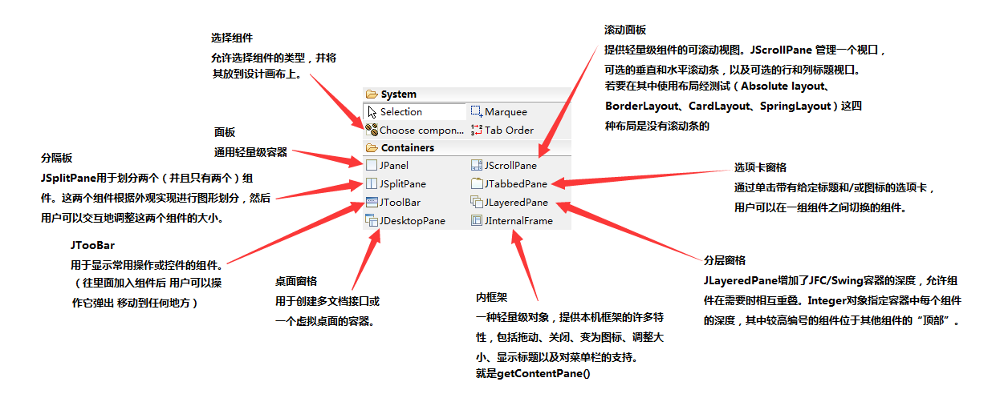
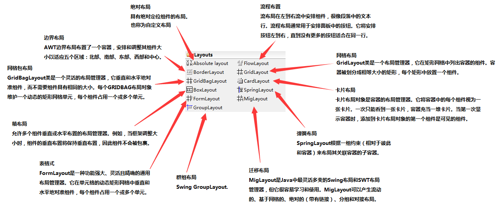
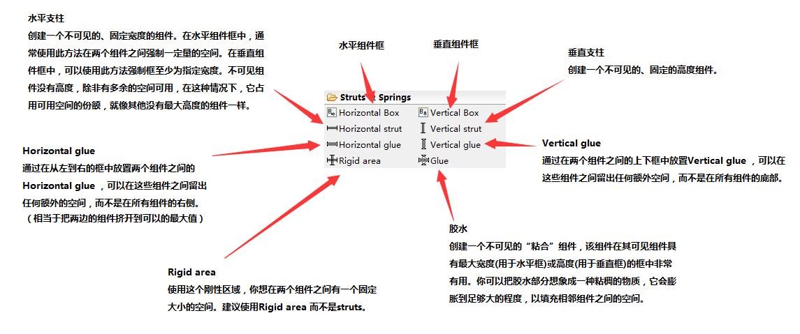
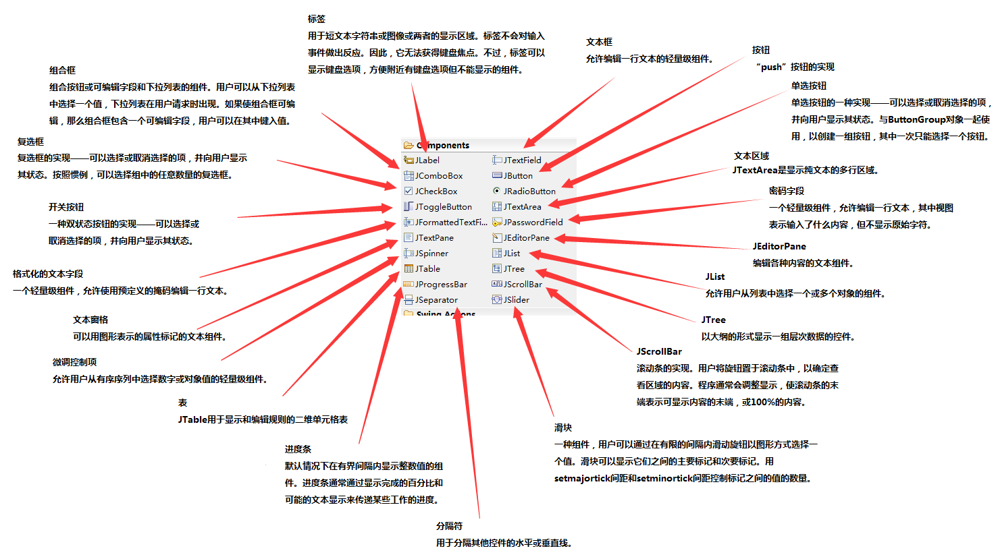

## 前言

> WindowBuilder - 是一个功能强大且易于使用的双向Java GUI设计器
> WindowBuilder由SWT Designer和Swing Designer组成，可以非常轻松地创建Java GUI应用程序，而无需花费大量时间编写代码。使用WYSIWYG可视化设计器和布局工具为复杂窗口创建简单的表单; 将为您生成Java代码。使用拖放轻松添加控件，向控件添加事件处理程序，使用属性编辑器更改控件的各种属性，使应用程序国际化等等。
> WindowBuilder是作为Eclipse和各种基于Eclipse的IDE（RAD，RSA，MyEclipse，JBuilder等）的插件而构建的。该插件构建了一个抽象语法树（AST）来导航源代码并使用GEF来显示和管理可视化表示。
> 生成的代码不需要任何其他自定义库来编译和运行：可以在不安装WindowBuilder Pro的情况下使用所有生成的代码。WindowBuilder Pro几乎可以读写任何格式，并可以反向工程大多数手工编写的Java GUI代码。它还支持自由格式代码编辑（在任何地方进行更改......不仅仅是在特殊区域）和大多数用户重新分解（您可以移动，重命名和细分方法而不会出现问题）
> —— Google 翻译

<!--more-->

### 插件安装

- Eclipse -> Help -> Install New Software 
- [版本选择](http://www.eclipse.org/windowbuilder/download.php) 选择合适的版本 (建议选择Integration Version 的)点击Link 把跳转的网址添加到Work with 点击 next 
- 若是一直加载， 把`Contact all update sites during install to find reauired software` 这项的勾去掉

### 面板









### 常用模块

```java
initialize()

//固定面板大小
frame.setResizable(false);

//获得屏幕大小d
Toolkit tk = Toolkit.getDefaultToolkit();
Dimension d = tk.getScreenSize();
//充满屏幕
frame.setSize(d);

//无边框
frame.setUndecorated(true);

main()

//使用自带UI

for (UIManager.LookAndFeelInfo info:UIManager.getInstalledLookAndFeels()) {
    if ("Nimbus".equals(info.getName())) {
        UIManager.setLookAndFeel(info.getClassName());
        break;
    }
}
/**
 * 自带三个UI
 * Metal 默认UI
 * Nimbus 个人感觉这个是里面最好的
 * CDE/Motif
 * 系统自带UI
 * Windows =》 Windows 、Windows Classic
 * Mac =》 Mac OS X
 * 其它 =》 GTK+
 */

//显示界面
frame.setVisible(true);

//设置全局字体
 static{
      Font font = new Font("仿宋", Font.BOLD, 15);
      FontUIResource fontRes = new FontUIResource(font);
      for (Enumeration<Object> keys = UIManager.getDefaults().keys();
           keys.hasMoreElements(); ) {
          Object key = keys.nextElement();
          Object value = UIManager.get(key);
          if (value instanceof FontUIResource) {
              UIManager.put(key, fontRes);
          }
      }
  }

//全局ESC 触发退出
static{
    Toolkit.getDefaultToolkit().addAWTEventListener(
    new AWTEventListener() {
        public void eventDispatched(AWTEvent awtEvent) {
            if (awtEvent.getID() == KeyEvent.KEY_PRESSED){
                KeyEvent event = (KeyEvent)awtEvent;
                if (event.getKeyCode() == KeyEvent.VK_ESCAPE){
                    Object[] options = {"确定","取消"};
                    int response= JOptionPane.showOptionDialog(null, 
                    "确认退出？", "",JOptionPane.YES_OPTION, 
                    JOptionPane.QUESTION_MESSAGE, null, options, 
                    options[0]);
                    if(response==0) {
                        frame.dispose();
                        System.exit(0);
                    }
                }
            }
        }
    },AWTEvent.KEY_EVENT_MASK);
}
```

### 获取焦点

```java
requestFocusInWindow
public boolean requestFocusInWindow()
如果这个组件的顶级祖先已经是焦点窗口，则请求该组件获得输入焦点。
这个组件必须是可显示的、可聚焦的、可见的，并且它的所有祖先(顶级窗口除外)必须是可见的，才能被授予请求。

void setFocusable(boolean focusable) 
设置此组件的是否可以**聚焦的状态**。 而不是获得焦点。
```

###JDialog 弹窗聚焦

```java
public static enum Dialog.ModalityType
extends Enum<Dialog.ModalityType>模态对话框阻止某些顶级窗口的所有输入。 
特定窗口是否被阻止取决于对话框的类型; 这被称为“阻塞范围”。 
ModalityType枚举指定模态类型及其关联范围。 

APPLICATION_MODAL 
APPLICATION_MODAL对话框将阻止来自同一Java应用程序的所有顶级窗口，但不包括其子层次结构中的顶级窗口。  
DOCUMENT_MODAL 
一个 DOCUMENT_MODAL对话框阻止输入到同一文档的所有顶级窗口，不同于它自己的子层次结构。  
MODELESS 
MODELESS对话框不会阻止任何顶级窗口。  
TOOLKIT_MODAL 
TOOLKIT_MODAL对话框阻止所有从同一工具包运行的顶级窗口，除了自己的子层次结构。  
```
**注意：如果在调用该Dialog时使用了 setVisible(true) 在其初始化的时候又使用了一次  setVisible(true) ，正常情况下不会看见有什么异常，但是若是加了APPLICATION_MODAL，则会让你关闭两次才行**