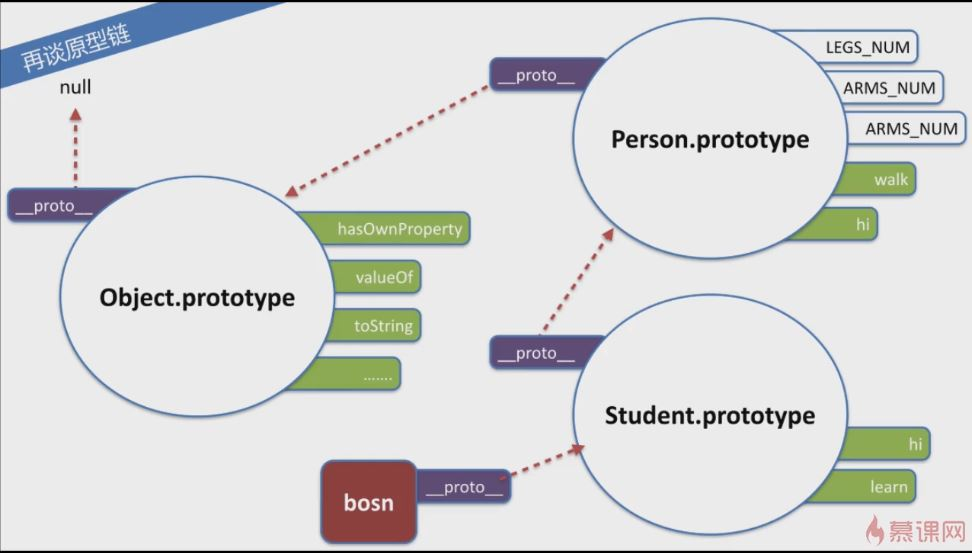

## 闭包&作用域

### 理解闭包
  
> 闭包是指 有权访问另一个函数作用域中的变量的 函数，闭包是定义在一个函数内部的函数
<!--more-->
```javascript
documnt.body.innerHTML = "<div id=div1>aaa</div>"+
"<div id=div2>bbb</div><div id=div3>ccc</div>";
for(var i = 1;1<4;i++){
	!function(i){ //匿名函数的一个写法，可以选择加括号或者感叹号
		document.getElementById('div'+i).
			addEventListener('click',function(){
				alert(i);
			}); //1,2,3
	}(i); //不加这个函数的话 点击弹出总是4
}
```

** 变量的作用域 **
- 函数内部可以直接读取全局变量。
- 函数外部自然无法读取函数内的局部变量。
- 函数内部声明变量，一定要使用var命令。如果不用，你实际上声明了一个全局变量！

----------

** 如何从外部读取局部变量？**
> Javascript语言特有的"链式作用域"结构（chain scope），子对象会一级一级地向上寻找所有父对象的变量。所以，父对象的所有变量，对子对象都是可见的，反之则不成立。

** 闭包的用途 **
1. 可以读取函数内部的变量
2. 让这些变量的值始终保持在内存中。

----------

```javascript
function f1(){
	　var n=999;
	　nAdd=function(){n+=1} 
	　//没有加var的全局匿名函数nAdd,匿名函数本身就是一个闭包
	　function f2(){
	　　　alert(n);
	　}
	　return f2;
}
var result=f1(); 
//返回的f2被赋给了一个全局变量,这导致f2始终在内存中，而f2的存在依赖于f1，
//因此f1也始终在内存中，不会在调用结束后，
//被垃圾回收机制（garbage collection）回收。
result(); // 999 
nAdd();	
result(); // 1000 
```

----------

**闭包的注意点**
> 1. 由于闭包会使得函数中的变量都被保存在内存中，内存消耗很大，所以不能滥用闭包，否则会造成网页的**性能问题**，在IE中可能导致**内存泄露**。解决方法是，在退出函数之前，将不使用的局部变量全部删除。
> 2. 闭包会在父函数外部，改变父函数内部变量的值。所以，如果你把父函数当作对象（object）使用，把闭包当作它的公用方法（Public Method），把内部变量当作它的私有属性（private value），这时一定要小心，不要随便改变父函数内部变量的值。

### 作用域

> 全局、函数、eval 三个作用域 没有块级作用域

### ES3 执行上下文

**JS解释器如何找到我们定义的函数和变量？**
- **变量对象(Variable Object，VO)** 是有一个抽象概念中的“对象”，它用于存储执行上下文中的：1. 变量 2. 函数声明 3. 函数参数

JS解释器初始化 VO上下文
```javascript
VO(globalContext) === [[global]];
[[global]] = {
	Math : <>,
	String : <>,
	isNaN : function(){[Native Code]}
	...
	window : global
};

GlobalContextVO (VO === this === global)

String(10); 	//[[global]].String(10);
window.a = 10; 	//[[global]].window.a = 10;
this.b = 20;	//[[global]].b = 20;
```

**函数中的激活对象 AO**
```javascript
VO(functionContext) === AO;
AO = {
	arguments : <Arg0>
};
arguments = {
	callee,
	length,
	properties-indexes
};
```
VO按照如下顺序填充
	1. 函数参数（若为传入 ，初始化该参数值为undefined）
	2. 函数声明（若发生命名冲突，会覆盖）
	3. 变量声明（初始化变量值为undefined，若发生命名冲突，会忽略。）
```javascript
function test(a,b){
	var c = 10; //赋值语句 不是变量初始化阶段做的
	function d(){}
	var e = function _e(){}; //函数表达式名 _e 不会影响VO
	(function x(){});
	b = 20; //变量声明冲突会被忽略
}
test(10);

AO(test)={
	a:10,
	b:undefined,
	c:undefined,
	d:<ref to func "d">
	e:undefined
};
```

| / |  函数声明 | 函数表达式 | 函数构造器 |
| :-------- | --------:| :------: |:------: |
| 前置		| ✔ 	|   	|  	|
| 允许匿名	|    	|  ✔  	|✔  |
| 立即调用	|   	|  ✔ 	|✔  |
| 通过函数名访问| ✔ 	|    	|  	|
| 没有函数名	|    	|    	|✔  |


## OOP

### 概念与继承

**封装、继承、多态、抽象**

```javascript
function Foo(){}
typeof Fpp.prototype; //"Object"
Foo.prototype.x = 1;

Foo.prototype
{
	constructor : Foo,
	__proto__ : Object.prototype,
	x : 1
}
```

```javascript
function Person(name,age){
	this.name = name;
	this.age = age;
}
Person.prototype.hi = function(){
	console.log('hi'+this.name+"i'm"+this.age);
}
Person.prototype.LEGS_NUM = 2;
Person.prototype.ARMS_NUM = 2;
Person.prototype.walk = function(){
	console.log(this.name + " is walking...");
}

function Student(name,age,className){
	Person.call(this,name,age);
	this.className = className;
}

Student.prototype = Object.create(Person.prototype);
//创建一个空对象 它的原型指向它的参数 如果不用create直接= 两个prototype就绑定一起了
Student.prototype.constructor = Student;
//保证一致性 如果不设置的话 会依据Person.prototype 指向Person

Student.prototype.hi = function(){ //覆盖
	console.log('hi,'+this.name+",i'm"+this.age+",from"+this.className);
};
Student.prototype.learn= function(subject){
	console.log(this.name + " is learning " +subject);
}

var bosn = new Student('Bosn',27,'Class3');
bosn.hi(); // hi,Bosn,i'm27,fromClass3
bson.LEGS_NUM; //2
bosn.walk();//Bosn is walking...
bosn.learn('math');//Bosn is learning math
```
原型链如下图


**并不是所有的函数都会继承至Object.prototype **` var o = new Obejct(null) ` `o.__proto__; //undefined`

### prototype属性
```javascript
Student.prototype.x = 101;
bosn.x; //101

Student.prototype = {y:2}; //prototype 指向了一个新的对象{y:2}
bosn.y; //undefined	//但是bosn上的prototype并没有改变指向 还是指向的原来的对象
bosn.x; // 101
bosn.__proto__;
//Object { constructor: Student(), hi: hi(), leran: leran(), x: 101 }

var n = new Student('v',1,'s');
n.x; // undefined
n.y; //2
```

### instanceof
- 左边一般要求是一个对象，右边要求是一个函数或者说是构造器，它会判断右边构造器的prototype的属性是否出现在左边对象的原型链上。
- 所有右边必须是一个函数对象，不是函数的话 就没有prototype属性 就会报错。
```javascript
[1,2] instanceof Array === true
new Obejct() instanceof Array === false
```

### 实现继承的多种方式
```javascript
function Person(){}
function Student(){}

[x] Student.prototype = Person.prototype; 
//1 改变Student.prototype的同时也会改变Person.prototype
[x] Student.prototype = new Person();
//2 因为调用了Person的构造函数新建了一个实例，若是Person需要传参 则会很奇怪
[√] Student.prototype = Object.create(Person.prototype);
//3 Student.prototype 修改不会影响到 Person.prototype 但是ES5之后才支持
ES5之前模拟 相当于1+2的结合
if(!Object.create){
	Object.create = function(prroto){
		function F(){}
		F.prototype = proto;
		return new F; 
	};
}
```
