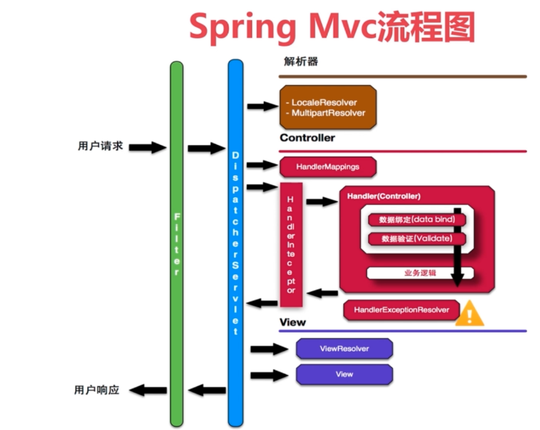

## SpringMVC流程

- 首先从左到右是客户端发起用户请求，以Http形式进入到Servlet容器中
<!-- more -->
- Servlet容器解析Http数据成为一个EndPonit对象
- EndPonit对象里面包含请求url、httpheader以及检验完或者读完的包内数据流
- 进入用户自定义的Filter，在Filter中用户可以对request进行处理，经过多个Filter处理完后
- 进入DisPatcherServlet（SpringMvc的入口），先进入到解析器（MultipartResolver）中，解析成对应的自己的流，以及把一些字符串K-V读出来封装到对象中，以供后续的Controller接收，除此就是通过请求URL寻找Handler（就是我们定义的Controller）过程了
- 由于我们在Controller方法中注解了RequestMapping映射，在启动过程中通过RequestMapping就会把URL与Controller对应方法注册到HandlerMapping中，如果无法在HandlerMapping找到请求对应的Controller，就会报404错误。否则会进入HandlerInterceptor（拦截器）
- HandlerInterceptor（拦截器）可以打印日志，做身份鉴权等一些操作，处理完后Spring会对数据进行绑定还会对数据进行验证，由RequestMapping注解方法里面的方法参数进行绑定，返回反射调用我们的Controller方法，这个时间就进入到具体的Controller方法体里面了
- 在Controller方法体中我们调用相应的Service进行处理，从Controller出来后，就开始创建ModelAndView这个对象了（Model：数据、View：模板），这个时候的View只是一个ViewName
- 如果我们定义了异常处理器，在拦截器处理数据绑定、数据验证处理这些所有的环节，只要出现了异常都会被异常处理器拦截掉，并在异常处理中返回相应的500页面
- 拦截器在做PostHandler之后，通过ViewResolver进行View（模板）的资源定位，找不到就转404页面
- 找到View之后，就是一个渲染页面的过程，实际是将数据进行模板变量替换的过程，数据来自Request，ModelMap、Session中，之后就通过DispatcherServlet方法、再Filter的后缀处理，最终通过Servlet容器返回客户端
